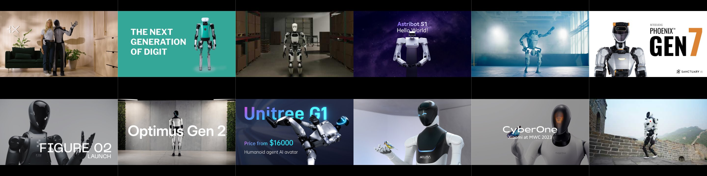

# 
🤖 Awesome List of AI Humanoid Robots

A curated list of top AI humanoid robots, featuring video demonstrations of their capabilities. This list showcases the most advanced AI humanoid robots. Each entry includes:

- Information about the company
- Links to their official website and YouTube channel
- Specific robot models with links to demonstration videos on YouTube

The goal is to provide an up-to-date overview of the state of the art in humanoid robotics.

Note: Your contributions are welcome! If you notice any missing information, errors, or typos, please open an issue or submit a pull request. Thank you!

## Index

### Companies

- [1X Technologies](#1x-technologies)
  - [EVE](#eve)
  - [NEO Beta](#neo-beta)
  - [NEO Gamma](#neo-gamma)
  - [NEO](#neo)
- [AgiBot](#agibot)
  - [AgiBot RAISE A1](#agibot-raise-a1)
  - [AgiBot A2](#agibot-a2)
- [Agility Robotics](#agility-robotics)
  - [Digit](#digit)
- [Apptronik](#apptronik)
  - [Apollo](#apollo)
  - [Astra](#astra)
- [Astribot](#astribot)
  - [Astribot S1](#astribot-s1)
- [Booster Robotics](#booster-robotics)
  - [Booster T1](#booster-t1)
- [Boston Dynamics](#boston-dynamics)
  - [Atlas](#atlas)
  - [HD Atlas](#hd-atlas-last-generation-hydraulic-atlas)
- [CASBOT](#casbot)
  - [CASBOT 01](#casbot-01)
- [Clone Robotics](#clone-robotics)
  - [Torso](#torso)
  - [Protoclone](#protoclone)
- [Deep Robotics](#deep-robotics)
  - [DR01](#dr01)
  - [DR02](#dr-02)
- [Diligent Robotics](#diligent-robotics)
  - [Moxi](#moxi)
- [DOBOT](#dobot)
 - [Atom](#atom)   
- [EngineAI](#engineai)
  - [SE01](#se01)
  - [PM01](#pm01)
- [Engineered Arts](#engineered-arts) -[Ameca](#ameca)
- [Figure AI](#figure-ai)
  - [Figure 01](#figure-01)
  - [Figure 02](#figure-02)
  - [Helix](#helix)
  - [Figure 03](#figure-03)
- [Foundation Robotics]()
  - [Phantom]()
- [Fourier](#fourier)
  - [GR-1](#gr-1)
  - [GR-2](#gr-2)
  - [GR-3](#gr-3)
  - [N1](#n1)
- [Galbot Robotics](#galbot-robotics)
  - [Galbot G1](#galbot-g1)
- [Hanson Robotics](#hanson-robotics)
  - [Sophia](#sophia)
- [Hexagon](#hexagon)
  - [AEON](#aeon)
- [Humanoid](#humanoid)
  - [HMND 01](#hmnd-01)
- [Kepler Robotics](#kepler-robotics)
  - [Forerunner K2](#forerunner-k2)
- [LimX Dynamics](#limx-dynamics)
  - [CL-1](#cl-1)
  - [Oli](#oli)
- [Mentee Robotics](#mentee-robotics)
  - [MenteeBot](#menteebot)
- [NEURA Robotics](#neura-robotics)
  - [4NE-1](#4ne-1)
- [PAL Robotics](#pal-robotics)
  - [TALOS](#talos)
- [PNDbotics](#pndbotics)
  - [Adam](#adam)
- [Pollen Robotics](#pollen-robotics)
  - [Reachy 2](#reachy-2)
- [Pudu Robotics](#pudu-robotics)
  - [PUDU D7](#pudu-d7)
  - [PUDU D9](#pudu-d9)
- [ROBOTERA](#robotera)
  - [Xhand](#xhand)
  - [XBot-L](#xbot-l)
  - [STAR1](#star1)
  - [Q5](#q5)
  - [L7](#l7)
- [Sanctuary AI](#sanctuary-ai)
  - [Phoenix Gen 7](#phoenix-gen-7)
- [Softbank Robotics](#softbank-robotics)
- [Tesla](#tesla)
  - [Optimus Gen 2](#tesla-botoptimus-gen-2)
- [UBTECH Robotics](#ubtech-robotics)
  - [Walker S](#walker-s)
  - [Walker X](#walker-x)
  - [Walker S1](#walker-s1)
  - [Walker C](#walker-c)
  - [Walker S2](#walker-s2)
- [Unitree Robotics](#unitree-robotics)
  - [Unitree G1](#unitree-g1)
  - [Unitree H1](#unitree-h1)
  - [Unitree R1](#unitree-r1)
  - [Unitree H2](#unitree-h2)
- [WIRobotics](#wirobotics)
  - [ALLEX](#allex)
- [Xiaomi](#xiaomi)
  - [CyberOne](#cyberone)
- [Xpeng](#xpeng)
  - [Iron](#iron)

### Related Lists and Sources

- [Lists](#lists)
- [Coverage of the topic in the media](#videos)

## 
1X Technologies

|                     |                                                         |
| ------------------- | ------------------------------------------------------- |
| **Name**            | 1X Technologies                                         |
| **Country**         | 🇺🇸 United States, 🇳🇴 Norway                             |
| **Headquarters**    | Sunnyvale, California, USA; Moss, Norway                |
| **Founded**         | 2014                                                    |
| **Website**         | https://www.1x.tech/                                    |
| **YouTube Channel** | https://www.youtube.com/@1X-tech                        |
| **GitHub**          | https://github.com/1x-technologies                      |
| **Crunchbase**      | https://www.crunchbase.com/organization/halodi-robotics |

### [EVE](https://www.youtube.com/watch?v=20GHG-R9eFI)

### [NEO Beta](https://www.youtube.com/watch?v=bUrLuUxv9gE)

### [NEO Gamma](https://www.youtube.com/watch?v=uVcBa6NXAbk)

### [NEO](https://www.youtube.com/watch?v=LTYMWadOW7c)

## 
AgiBot

|                     |                                        |
| ------------------- | -------------------------------------- |
| **Name**            | AgiBot (also known as Zhiyuan Robotics)|
| **Country**         | 🇨🇳 China                               |
| **Headquarters**    | Shanghai, China                        |
| **Founded**         | 2023                                   |
| **Website**         | https://www.agibot.com/                |
| **YouTube Channel** | https://www.youtube.com/@About-AgiBot  |
| **Wikipedia**       | https://en.wikipedia.org/wiki/AgiBot   |

### [AgiBot RAISE A1](https://www.youtube.com/watch?v=PIYJtZmzs70)

### [AgiBot A2](https://www.youtube.com/watch?v=DQHGV3hrnL0)

## 
Agility Robotics

|                     |                                                          |
| ------------------- | -------------------------------------------------------- |
| **Name**            | Agility Robotics, Inc.                                   |
| **Country**         | 🇺🇸 United States                                         |
| **Headquarters**    | Albany, Oregon, USA                                      |
| **Founded**         | 2015                                                     |
| **Website**         | https://agilityrobotics.com/                             |
| **YouTube Channel** | https://www.youtube.com/@AgilityRobotics                 |
| **Wikipedia**       | https://en.wikipedia.org/wiki/Agility_Robotics           |
| **Crunchbase**      | https://www.crunchbase.com/organization/agility-robotics |

### [Digit](https://www.youtube.com/watch?v=rnFZAB9ogEE)

## 
Apptronik

|                     |                                        |
| ------------------- | -------------------------------------- |
| **Name**            | Apptronik, Inc.                        |
| **Country**         | 🇺🇸 United States                       |
| **Headquarters**    | Austin, Texas, USA                     |
| **Founded**         | 2012                                   |
| **Website**         | https://apptronik.com/                 |
| **YouTube Channel** | https://www.youtube.com/@apptronik8459 |
| **Wikipedia**       | -                                      |

### [Apollo](https://www.youtube.com/watch?v=uJOA5IDaL5g)

### [Astra](https://www.youtube.com/watch?v=XulyFshFQMg)

## 
Astribot

|                     |                                    |
| ------------------- | ---------------------------------- |
| **Name**            | Astribot Inc.                      |
| **Country**         | 🇨🇳 China                           |
| **Headquarters**    | Shenzhen, China                    |
| **Founded**         | 2022                               |
| **Website**         | https://astribot.com/index-en.html |
| **YouTube Channel** | https://www.youtube.com/@Astribot  |
| **Wikipedia**       | -                                  |

### [Astribot S1](https://www.youtube.com/watch?v=AePEcHIIk9s)

## 
Booster Robotics

|                     |                                          |
| ------------------- | ---------------------------------------- |
| **Name**            | Booster Robotics Technology Co., Ltd.    |
| **Country**         | 🇨🇳 China                                 |
| **Headquarters**    | Beijing, China                           |
| **Founded**         | 2023                                     |
| **Website**         | https://boosterobotics.com/              |
| **YouTube Channel** | https://www.youtube.com/@BoosterRobotics |

### [Booster T1](https://www.youtube.com/watch?v=WXcz-4QBmTY)

## 
Boston Dynamics

|                     |                                               |
| ------------------- | --------------------------------------------- |
| **Name**            | Boston Dynamics, Inc.                         |
| **Country**         | 🇺🇸 United States                              |
| **Headquarters**    | Waltham, Massachusetts, USA                   |
| **Founded**         | 1992                                          |
| **Website**         | https://www.bostondynamics.com                |
| **YouTube Channel** | https://www.youtube.com/@BostonDynamics       |
| **Wikipedia**       | https://en.wikipedia.org/wiki/Boston_Dynamics |

### [Atlas](https://www.youtube.com/watch?v=29ECwExc-_M)

### [HD Atlas](https://www.youtube.com/watch?v=-9EM5_VFlt8) (last generation hydraulic Atlas)

## 
CASBOT

|                     |                                                        |
| ------------------- | ------------------------------------------------------ |
| **Name**            | Lingbao CASBOT                                         |
| **Country**         | 🇨🇳 China                                               |
| **Headquarters**    | Beijing, China                                         |
| **Founded**         | 2023                                                   |
| **Website**         | https://www.casbot.tech/                               |
| **Crunchbase**      | https://www.crunchbase.com/organization/lingbao-casbot |

### [CASBOT 01](https://www.youtube.com/watch?v=GZsgJ-wg6SI)

### [CASBOT 02]()

## 
Clone Robotics

|                     |                                                          |
| ------------------- | -------------------------------------------------------- |
| **Country**         | 🇵🇱 Poland                                                |
| **Headquarters**    | Wrocław, Poland                                          |
| **Founded**         | 2021                                                     |
| **Website**         | https://clonerobotics.com/                               |
| **YouTube Channel** | https://www.youtube.com/channel/UCd0xLOw6No5IAsq3Y2-b0eA |
| **Crunchbase**      | https://www.crunchbase.com/organization/clone            |

### [Torso](https://www.youtube.com/watch?v=5mSE6Tkhy4g)

### [Protoclone](https://www.youtube.com/watch?v=H7dhwFcuUn0)

## 
Deep Robotics

|                     |                                                          |
| ------------------- | -------------------------------------------------------- |
| **Country**         | 🇨🇳 China                                                 |
| **Headquarters**    | Hangzhou, Zhejiang, China                                |
| **Founded**         | 2017                                                     |
| **Website**         | https://www.deeprobotics.cn/                             |
| **YouTube Channel** | https://www.youtube.com/channel/UCj73fOsxOlugnBPJOoM9rHw |
| **Wikipedia**       | https://en.wikipedia.org/wiki/Deep_Robotics              |
| **GitHub**          | https://github.com/DeepRoboticsLab                       |

### [DR01](https://www.youtube.com/watch?v=lCFyfh3mLOQ)

### [DR02](https://www.youtube.com/watch?v=e0cIZgkTn4M)

## 
Diligent Robotics

|                     |                                                           |
| ------------------- | --------------------------------------------------------- |
| **Name**            | Diligent Robotics Inc.                                    |
| **Country**         | 🇺🇸 United States                                          |
| **Headquarters**    | Austin, Texas, USA                                        |
| **Founded**         | 2017                                                      |
| **Website**         | https://www.diligentrobots.com/                           |
| **YouTube Channel** | https://www.youtube.com/@diligentrobotics674              |
| **Crunchbase**      | https://www.crunchbase.com/organization/diligent-robotics |

### [Moxi](https://www.youtube.com/watch?v=TAS0LpNR-Gw)

## 
DOBOT

### [Atom](https://www.youtube.com/watch?v=CrDyoVR2dnk)

## 
EngineAI

|                     |                                                  |
| ------------------- | ------------------------------------------------ |
| **Country**         | 🇨🇳 China                                         |
| **Headquarters**    | Shenzhen, Guangdong, China                       |
| **Founded**         | 2023                                             |
| **Website**         | https://www.engineai.com.cn/                     |
| **YouTube Channel** | https://www.youtube.com/@Engineairobot           |
| **Wikipedia**       | https://en.wikipedia.org/wiki/Engine_AI          |
| **Crunchbase**      | https://www.crunchbase.com/organization/engineai |

### [SE01](https://www.youtube.com/watch?v=I7Oh-ma4o1A)

### [PM01](https://www.youtube.com/watch?v=j-uMnH_f7cU)

## 
Engineered Arts

|                     |                                               |
| ------------------- | --------------------------------------------- |
| **Name**            | Engineered Arts Ltd                           |
| **Country**         | 🏴󠁧󠁢󠁥󠁮󠁧󠁿 England                                    |
| **Headquarters**    | Falmouth, Cornwall, England                   |
| **Founded**         | 2004                                          |
| **Website**         | https://engineeredarts.co.uk/                 |
| **YouTube Channel** | https://www.youtube.com/@EngineeredArtsLtd    |
| **Wikipedia**       | https://en.wikipedia.org/wiki/Engineered_Arts |

### [Ameca](https://www.youtube.com/watch?v=IPukuYb9xWw)

## 
Figure AI

|                     |                                         |
| ------------------- | --------------------------------------- |
| **Name**            | Figure AI, Inc.                         |
| **Country**         | 🇺🇸 United States                        |
| **Headquarters**    | Sunnyvale, California, USA              |
| **Founded**         | 2022                                    |
| **Website**         | https://www.figure.ai/                  |
| **YouTube Channel** | https://www.youtube.com/@figureai       |
| **Wikipedia**       | https://en.wikipedia.org/wiki/Figure_AI |

### [Figure 01](https://www.youtube.com/watch?v=b37rQZ4maPo)

### [Figure 02](https://www.youtube.com/watch?v=0SRVJaOg9Co)

### [Helix](https://www.youtube.com/watch?v=Z3yQHYNXPws)

### [Figure 03](https://www.youtube.com/watch?v=Eu5mYMavctM)

## 
Fourier

|                     |                                                       |
| ------------------- | ----------------------------------------------------- |
| **Country**         | 🇨🇳 China                                              |
| **Headquarters**    | Shanghai, China                                       |
| **Founded**         | 2015                                                  |
| **Website**         | https://fourierintelligence.com/                      |
| **YouTube Channel** | https://www.youtube.com/@FourierIntelligence-Robotics |
| **Wikipedia**       | https://en.wikipedia.org/wiki/Fourier_(company)       |

### [GR-1](https://www.youtube.com/watch?v=_MBd_XfXy9M)

### [GR-2](https://www.youtube.com/watch?v=jWTWWuzB6Cg)

### [GR-3](https://www.youtube.com/watch?v=siuwJWkjDgs)

### [N1](https://www.youtube.com/watch?v=b94_W7JiR-8)

## 
Galbot Robotics

|                     |                                                               |
| ------------------- | ------------------------------------------------------------- |
| **Name**            | Beijing Galaxy General Robot Co., Ltd. (also known as Galbot) |
| **Country**         | 🇨🇳 China                                                      |
| **Founded**         | 2023                                                          |
| **Website**         | https://www.galbot.com/                                       |
| **YouTube Channel** | https://www.youtube.com/channel/UCtWK-1gf-HoocxS-DUirRow      |

### [Galbot G1](https://www.youtube.com/watch?v=9ML9mOcHSQA)

## 
Hanson Robotics

|                     |                                                |
| ------------------- | ---------------------------------------------- |
| **Name**            | Hanson Robotics Limited                        |
| **Country**         | 🇭🇰 Hong Kong                                   |
| **Headquarters**    | Science Park, Hong Kong                        |
| **Founded**         | 2007                                           |
| **Website**         | https://www.hansonrobotics.com/                |
| **YouTube Channel** | https://www.youtube.com/@HansonRoboticsLimited |
| **Wikipedia**       | https://en.wikipedia.org/wiki/Hanson_Robotics  |

### Sophia

## 
Hexagon

### [AEON](https://www.youtube.com/watch?v=ytPGe63TtOg)

## 
Humanoid

|                     |                                        |
| ------------------- | -------------------------------------- |
| **Country**         | 🇬🇧 United Kingdom                      |
| **Headquarters**    | London, England                        |
| **Founded**         | 2024                                   |
| **Website**         | https://thehumanoid.ai/                |
| **YouTube Channel** | https://www.youtube.com/@TheHumanoidAI |

### [HMND 01](https://www.youtube.com/watch?v=x0nTOypt0zA)

## 
Kepler Robotics

|                     |                                      |
| ------------------- | ------------------------------------ |
| **Country**         | 🇨🇳 China                             |
| **Founded**         | 2023                                 |
| **Website**         | https://www.gotokepler.com/home      |
| **YouTube Channel** | https://www.youtube.com/@KeplerRobot |

### [Forerunner K2](https://www.youtube.com/watch?v=iWC8rSjDywU)

## 
LimX Dynamics

|                  |                                          |
| ---------------- | ---------------------------------------- |
| **Country**      | 🇨🇳 China                                 |
| **Headquarters** | Shenzhen, China                          |
| **Website**         | https://www.limxdynamics.com/en      |
| **YouTube Channel** | https://www.youtube.com/@LimXDynamics |

### [CL-1](https://www.youtube.com/watch?v=11Iz8x27jS4)

### [Oli](https://www.youtube.com/watch?v=Ms5Mn2zHp4E)

## 
Mentee Robotics

|                     |                                                         |
| ------------------- | ------------------------------------------------------- |
| **Name**            | Mentee Robotics                                         |
| **Country**         | 🇮🇱 Israel                                               |
| **Headquarters**    | Herzliya, Israel                                        |
| **Founded**         | 2022                                                    |
| **Website**         | https://www.menteebot.com/                              |
| **YouTube Channel** | https://www.youtube.com/@menteebot                      |
| **Crunchbase**      | https://www.crunchbase.com/organization/mentee-robotics |

### [MenteeBot](https://www.youtube.com/watch?v=fzjdXD1pGpI)

## 
NEURA Robotics

|                     |                                        |
| ------------------- | -------------------------------------- |
| **Name**            | NEURA Robotics GmbH                    |
| **Country**         | 🇩🇪 Germany                             |
| **Headquarters**    | Metzingen, Germany                     |
| **Founded**         | 2019                                   |
| **Website**         | https://neura-robotics.com/            |
| **YouTube Channel** | https://www.youtube.com/@NEURARobotics |
| **Wikipedia**       | https://en.wikipedia.org/wiki/Neura_Robotics |

### [4NE-1](https://www.youtube.com/watch?v=SGR-FTNeMAI)

## 
PAL Robotics

|                     |                                        |
| ------------------- | -------------------------------------- |
| **Country**         | 🇪🇸 Spain                               |
| **Headquarters**    | Barcelona, Spain                       |
| **Founded**         | 2004                                   |
| **Website**         | https://pal-robotics.com/              |
| **YouTube Channel** | https://www.youtube.com/@NEURARobotics |

### [TALOS](https://www.youtube.com/watch?v=qVzHe8FG984)

## 
PNDbotics

|                     |                                           |
| ------------------- | ----------------------------------------- |
| **Country**         | 🇨🇳 China                                  |
| **Headquarters**    | Beijing, China                            |
| **Founded**         | 2024                                      |
| **Website**         | https://www.pndbotics.com/                |
| **YouTube Channel** | https://www.youtube.com/@PNDbotics/videos |
| **Crunchbase**      | https://www.crunchbase.com/organization/pndbotics |

### [Adam](https://www.youtube.com/watch?v=Nmyymmd7bgE)

## 
Pollen Robotics

### [Reachy 2](https://www.youtube.com/watch?v=T3RdwDkZA9c)

## 
Pudu Robotics

|                     |                                       |
| ------------------- | ------------------------------------- |
| **Country**         | 🇨🇳 China                              |
| **Headquarters**    | Shenzhen, China                       |
| **Founded**         | 2016                                  |
| **Website**         | https://www.pudurobotics.com/         |
| **YouTube Channel** | https://www.youtube.com/@PuduRobotics |

### [PUDU D7](https://www.youtube.com/watch?v=CbA9wA9etGA)

### [PUDU D9](https://www.youtube.com/watch?v=gd5DdfJX_RM)

## 
ROBOTERA

|                     |                                         |
| ------------------- | --------------------------------------- |
| **Country**         | 🇨🇳 China                                |
| **Headquarters**    | Beijing, China                          |
| **Founded**         | 2023                                    |
| **Website**         | https://www.robotera.com/               |
| **YouTube Channel** | https://www.youtube.com/@ROBOTERA-pg4ew |

### [Xhand](https://www.youtube.com/watch?v=Iq9mgwy5o7U)

### [XBot-L](https://www.youtube.com/watch?v=nx2YO3twZYs)

### [STAR1](https://www.youtube.com/watch?v=ergiT1fglCk)

### [Q5](https://www.youtube.com/watch?v=WgR7IIzzfR0)

### [L7](https://www.youtube.com/watch?v=muu3Bqo9RkI)

## 
Sanctuary AI

|                     |                                         |
| ------------------- | --------------------------------------- |
| **Name**            | Sanctuary Cognitive Systems Corporation |
| **Country**         | 🇨🇦 Canada                               |
| **Headquarters**    | Vancouver, British Columbia, Canada     |
| **Founded**         | 2018                                    |
| **Website**         | https://sanctuary.ai/                   |
| **YouTube Channel** | https://www.youtube.com/@sanctuaryai    |
| **Crunchbase**      | https://www.crunchbase.com/organization/sanctuary-ai |

### [Phoenix Gen 7](https://www.youtube.com/watch?v=-HizP4UQvug)

## 
Softbank Robotics

|             |                                  |
| ----------- | -------------------------------- |
| **Name**    | Softbank Robotics America, Inc.  |
| **Website** | https://us.softbankrobotics.com/ |

## 
Tesla

|                     |                                           |
| ------------------- | ----------------------------------------- |
| **Name**            | Tesla, Inc.                               |
| **Country**         | 🇺🇸 United States                          |
| **Headquarters**    | Austin, Texas, USA                        |
| **Founded**         | 2003                                      |
| **Website**         | https://www.tesla.com                     |
| **YouTube Channel** | https://www.youtube.com/@tesla            |
| **Wikipedia**       | https://en.wikipedia.org/wiki/Tesla,_Inc. |

### [Tesla Bot/Optimus Gen 2](https://www.youtube.com/watch?v=cpraXaw7dyc)

## 
UBTECH Robotics

|                     |                                         |
| ------------------- | --------------------------------------- |
| **Name**            | UBTECH Robotics                         |
| **Country**         | 🇨🇳 China                                |
| **Headquarters**    | Shenzhen, China                         |
| **Founded**         | 2012                                    |
| **Website**         | https://www.ubtrobot.com/               |
| **YouTube Channel** | https://www.youtube.com/@ubtechrobotics |
| **Wikipedia**       | https://en.wikipedia.org/wiki/UBtech_Robotics |

### [Walker S](https://www.youtube.com/watch?v=8MRDF2pkIRs&t=0s)

### [Walker X](https://www.youtube.com/watch?v=4ZL3LgdKNbw)

### [Walker S1](https://www.youtube.com/watch?v=UBbk18oZbTc)

### [Walker C](https://www.youtube.com/watch?v=ZyUDaRwDtuc)

### [Walker S2](https://www.youtube.com/watch?v=TNryO2uasws)

## 
Unitree Robotics

|                     |                                                |
| ------------------- | ---------------------------------------------- |
| **Name**            | Unitree Robotics                               |
| **Country**         | 🇨🇳 China                                       |
| **Headquarters**    | Hangzhou City, Zhejiang Province, China        |
| **Founded**         | 2016                                           |
| **Website**         | https://www.unitree.com/                       |
| **YouTube Channel** | https://www.youtube.com/@unitreerobotics       |
| **Wikipedia**       | https://en.wikipedia.org/wiki/Unitree_Robotics |

### [Unitree G1](https://www.youtube.com/watch?v=GzX1qOIO1bE)

### [Unitree H1](https://www.youtube.com/watch?v=83ShvgtyFAg)

### [Unitree R1](https://www.youtube.com/watch?v=v1Q4Su54iho)

### [Unitree H2](https://www.youtube.com/watch?v=eUdBIFkMh-M)

## 
WIRobotics

|                     |                                                    |
| ------------------- | -------------------------------------------------- |
| **Country**         | 🇰🇷 South Korea                                     |
| **Headquarters**    | Yongin, Ch'ungch'ong-namdo, South Korea            |
| **YouTube Channel** | https://www.youtube.com/@WIRobotics                |
| **Website**         | https://www.wirobotics.com                         |
| **Crunchbase**      | https://www.crunchbase.com/organization/wirobotics |

### [ALLEX](https://www.youtube.com/watch?v=qT2UZ3oN4xI)

## 
Xiaomi

|                     |                                      |
| ------------------- | ------------------------------------ |
| **Name**            | Xiaomi Corporation                   |
| **Country**         | 🇨🇳 China                             |
| **Headquarters**    | Beijing, China                       |
| **Founded**         | 2010                                 |
| **Website**         | https://www.mi.com/                  |
| **YouTube Channel** | https://www.youtube.com/@xiaomi      |
| **Wikipedia**       | https://en.wikipedia.org/wiki/Xiaomi |

### [CyberOne](https://www.youtube.com/watch?v=I28Q9czUx2Q)

## 
Xpeng

|                     |                                            |
| ------------------- | ------------------------------------------ |
| **Country**         | 🇨🇳 China                                   |
| **Headquarters**    | Guangzhou, Guangdong, China                |
| **Founded**         | 2014                                       |
| **YouTube Channel** | https://www.youtube.com/@XPENGMotorsGlobal |
| **Website**         | https://www.xiaopeng.com/                  |
| **Wikipedia**       | https://en.wikipedia.org/wiki/XPeng        |

### [Iron](https://www.youtube.com/watch?v=4AOpIeNjmdc)

## Related Lists and Sources

### More lists and resources

- [List of Commercial Humanoid Robots](https://nathan-peterman.com/List-of-Commercial-Humanoid-Robots-48c44dcf0efc452eab6697b78292f4af)
- [BotsLikeYou](https://www.botslikeyou.com/comparator-robot)
- [Awesome Robotics and Artificially Intelligence Agent Companies](https://github.com/balloch/awesome-robotics-ai-companies)
- [Reddit: r/robotics](https://www.reddit.com/r/robotics/)
- [IEEE ROBOTS](https://robotsguide.com/)
- [awesome-humanoid-learning](https://github.com/jonyzhang2023/awesome-humanoid-learning)
- [Awesome Robot Descriptions](https://github.com/robot-descriptions/awesome-robot-descriptions)
- [Humanoid.guide](https://humanoid.guide/)

### Videos

- CNBC Report: Why Nvidia, Tesla, Amazon And More Are Betting Big On AI-Powered Humanoid Robots  
  
- NBC News: Inside big tech's A.I. robot race  
  
- CNET: Unitree G1 vs. Boston Dynamics Atlas: Hypermobility in Humanoid Robots  
  
- CNET: Atlas vs. Optimus: Boston Dynamics & Tesla's Humanoid Robots  
  
- CNET: Humanoid Robots Head Home: Meet NEO Beta  
  
- CNET: Meet the $16K Humanoid Robot Leaping Into Production  
  
